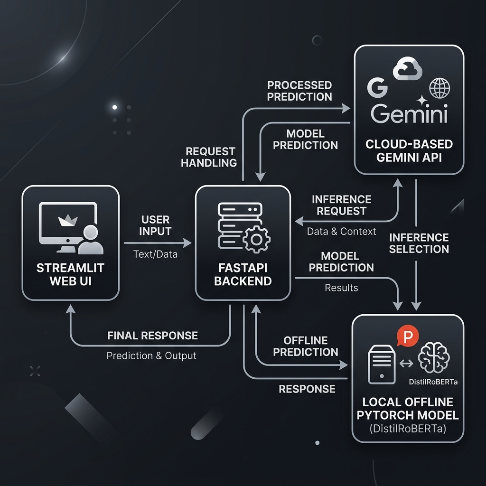
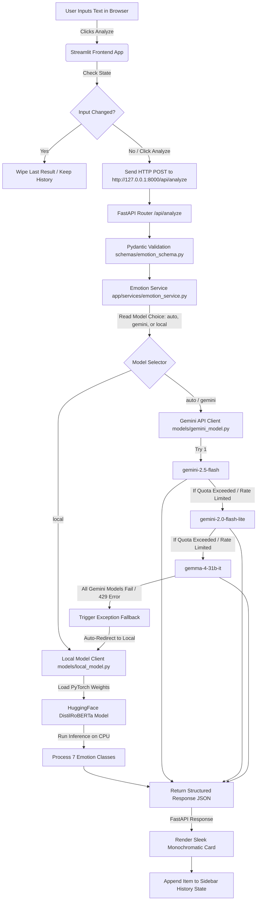

# 🧠 Emotion Detector AI — Presentation & Technical Explainer Guide

This guide serves as a comprehensive **Technical Reference and Presentation/Viva Prep Document** for the Emotion Detector AI project. It details the system architecture, file dependencies, technical definitions, and expected question-and-answers for your presentation slide-deck or academic viva.

---

## 🗺️ System Architecture

The following Mermaid diagram visualizes the end-to-end data flow, request routing, and automatic model fallback logic of the application:

---

## 📂 File-by-File Explainer

### 1. Root Directory Files
*   **`run.bat` (Batch Launcher):** 
    *   *Purpose:* Single-click launcher for Windows.
    *   *How it works:* Checks if Anaconda is installed at `C:\Users\suraj\anaconda3\python.exe`. If found, it uses it to start both the FastAPI backend and Streamlit frontend concurrently in two clean independent Command Prompt windows using the `start` command. This bypasses PowerShell's execution policies and parser boundaries.
*   **`README.md` (Main Documentation):**
    *   *Purpose:* Developer portal showing features, directory mappings, quick setup, manual activation scripts, and model configurations.

### 2. Frontend Application (`frontend/`)
*   **`frontend/requirements.txt`:** Specifies dependencies: `streamlit` (UI framework) and `requests` (for calling the backend APIs).
*   **`frontend/app.py`:**
    *   *Role:* The user interface layer.
    *   *Key Mechanisms:*
        *   **Health Checker:** Silently pings the `/api/health` endpoint on load. If the backend is dead, it overrides the page with a clean warning banner.
        *   **Monochromatic Noir Design:** Injects vanilla CSS to style the entire page in pure black (`#09090b`), dark silver (`#a1a1aa`), and clean white (`#ffffff`).
        *   **Session State (`st.session_state`):** Dynamically caches the active result (`last_result`) and history list (`history`) so they persist across page reruns, while wiping them cleanly if you start typing a new query.
        *   **Grayscale Filters:** Uses CSS `filter: grayscale(100%)` on emojis (`🧠`, smiles, and sidebar items) to deliver a high-end monochromatic look.

### 3. Backend Application (`backend/`)
*   **`backend/requirements.txt`:** Installs `fastapi`, `uvicorn` (server), `pydantic` (validation), `google-generativeai` (Gemini SDK), `torch` (PyTorch for deep learning), and `transformers` (HuggingFace library).
*   **`backend/.env` & `.env.example`:** Secure stores the sensitive `GEMINI_API_KEY` locally, preventing key leakage on GitHub via `.gitignore`.
*   **`backend/app/main.py`:** Initializes the FastAPI app, configures loose CORS (Cross-Origin Resource Sharing) permissions so other frontends can query it, and binds the router.
*   **`backend/app/api/routes.py`:**
    *   *Role:* Defines endpoints.
    *   *`/api/health`:* Simple uptime check returning `{"status": "healthy"}`.
    *   *`/api/analyze`:* Receives the request payload, validates it using Pydantic schemas, and hands it to the Service layer.
*   **`backend/app/schemas/emotion_schema.py`:** Uses Pydantic to enforce that inputs are non-empty strings under 1000 characters and model options are strictly `auto`, `gemini`, or `local`.
*   **`backend/app/services/emotion_service.py`:**
    *   *Role:* The orchestrator / coordinator.
    *   *Mechanism:* If `model_choice` is "local", it calls the local model. If "gemini", it calls Gemini. If "auto", it tries Gemini first; if any quota limit or network exception is caught, it instantly falls back to the local model, ensuring the user gets a seamless response.
*   **`backend/app/models/gemini_model.py`:**
    *   *Role:* External API client.
    *   *Mechanism:* Cascades through `gemini-2.5-flash` ➔ `gemini-2.0-flash-lite` ➔ `gemma-4-31b-it` sequentially. If one model returns a 429 quota exhaustion error, it catches it and slides to the next available free model.
*   **`backend/app/models/local_model.py`:**
    *   *Role:* Local Inference Engine.
    *   *Mechanism:* Loads the pretrained `j-hartmann/emotion-english-distilroberta-base` model. It tokenizes the input text, runs it through PyTorch layers, extracts classification logits, and returns the highest confidence emotion.

---

## 🎓 Expected Viva / Presentation Q&A

### Q1: What is the core business problem/objective of this project?
**Answer:** The objective is to build a highly available, robust, and beautiful sentiment classification application. By decoupling the architecture into a FastAPI backend and a Streamlit frontend, we ensure the system is scalable. By implementing a **hybrid inference pipeline**, the system guarantees **100% uptime**: it leverages state-of-the-art LLMs (Gemini API) for advanced text understanding, but seamlessly degrades to a local CPU-based neural network (Transformers) if API quotas are exhausted or internet connectivity is lost.

---

### Q2: What exact models are used in this project?
**Answer:** 
1.  **Cloud-based LLM Cascade:**
    *   `gemini-2.5-flash` (Primary cloud model: Fast, highly capable, large context window).
    *   `gemini-2.0-flash-lite` (Secondary cloud model: High-speed, optimized for low latency).
    *   `gemma-4-31b-it` (Local-optimized lightweight instruction model via API).
2.  **Local Deep Learning Model:**
    *   `j-hartmann/emotion-english-distilroberta-base` (Offline transformer fine-tuned on 6 emotion datasets).

---

### Q3: Did you train the local model yourself? How was it trained?
**Answer:** The model was not trained from scratch by us. Instead, we leveraged **Transfer Learning** and **Fine-Tuning**.
*   We use a pre-trained **DistilRoBERTa** model (a compressed, faster version of Facebook's RoBERTa architecture, which is itself an optimized variant of Google's original **BERT (Bidirectional Encoder Representations from Transformers)** model).
*   It has been fine-tuned on **6 diverse emotion classification datasets** (including GoEmotions, ISEAR, and SemEval) containing thousands of labeled social media posts, essays, and dialogues.
*   It classifies input text into **7 distinct human emotion labels**: *Joy, Sadness, Anger, Fear, Surprise, Disgust, and Neutral*.

---

### Q4: How does a Transformer model (like DistilRoBERTa) work under the hood?
**Answer:**
1.  **Tokenization:** The raw input text is split into sub-word tokens and mapped to unique numerical IDs.
2.  **Embeddings:** These tokens are converted into high-dimensional vector representations.
3.  **Self-Attention Mechanism:** The core of the Transformer. It computes attention scores to determine how much weight/importance each word has relative to every other word in the sentence (capturing context bidirectionally).
4.  **Classification Layer:** The final output of the transformer layers (the CLS token vector) is passed to a fully connected linear layer with a **Softmax** activation function, which outputs a probability distribution across the 7 emotion classes.

---

### Q5: What is the "Cascading Fallback Logic" and how is it implemented?
**Answer:**
We have implemented fallback at two distinct layers:
1.  **API Layer Cascade (`gemini_model.py`):** We loop through a list of available Gemini models. If a call fails due to `429 (ResourceExhausted)` or rate limits, the loop catches the exception, logs it, and immediately retries the prompt with the next model in the array.
2.  **Service Layer Fallback (`emotion_service.py`):** In `Auto` mode, if the entire Gemini API cascade fails (e.g. no internet, completely exhausted billing quota), the outer `try-except` block catches the error and silently routes the text to the `LocalModel` class. The user never notices the crash; they simply see the result card source change to `Local Model`.

---

### Q6: Where does this project store data and history?
**Answer:**
*   **State Management:** The app uses **Streamlit Session State (`st.session_state`)** to store real-time data (`last_result` and the list of the last 8 entries in `history`).
*   **Volatile Caching:** Streamlit's session state is a temporary memory cache bound to the specific user's browser session. It resides in the RAM of the running Streamlit python process.
*   **Architecture Benefit:** By not forcing a heavy persistent database (like MySQL or PostgreSQL) for a simple dashboard, we keep the deployment lightweight, lightning-fast, and completely zero-configuration for the end-user.

---

### Q7: Why did you separate the Backend (FastAPI) and Frontend (Streamlit)? Why not do everything inside Streamlit?
**Answer:**
Decoupling the frontend and backend is a **software engineering best practice**:
1.  **Separation of Concerns:** Streamlit should focus entirely on user experience, styles, and rendering. FastAPI handles heavy CPU operations (PyTorch tokenizers) and external API handshakes.
2.  **Scalability:** If we need to scale this app, we can deploy the FastAPI backend to a GPU-powered cloud instance (like AWS EC2) and host the lightweight Streamlit UI on a free static page host.
3.  **Extensibility:** Because the backend is a standard REST API, we can easily build a Mobile App (iOS/Android) or a React/Vue Web App in the future that calls the exact same `/api/analyze` endpoint without rewriting a single line of machine learning logic.
